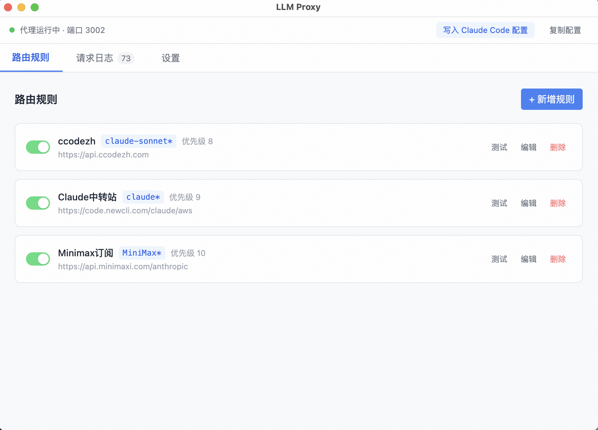
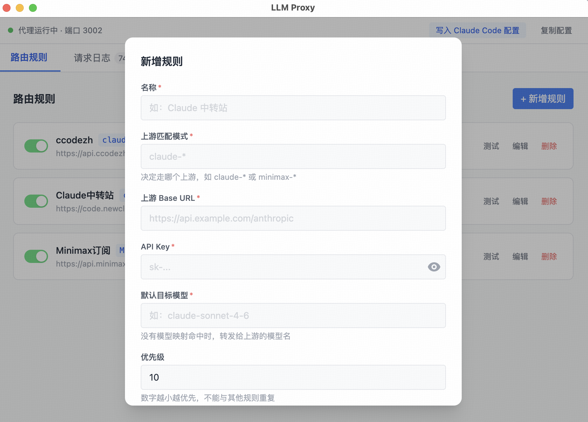

# Claude Proxy

[](https://github.com/Fangfang-Lee/claude-proxy/releases/latest)
[](https://github.com/Fangfang-Lee/claude-proxy/releases)
[](https://www.electronjs.org/)
[](LICENSE)

## 下载安装

### 最新版本

**macOS (Apple Silicon)**: [Claude Proxy-1.0.2-arm64.dmg](https://github.com/Fangfang-Lee/claude-proxy/releases/latest)

> 由于应用未经过 Apple 签名，首次打开时可能出现"无法打开"的提示，有两种解决方法：
>
> **方法一（推荐）**：在 Finder 中右键点击应用 → 选择"打开" → 点击"打开"
>
> **方法二**：在终端运行以下命令后即可正常打开：
> ```bash
> sudo xattr -cr "/Applications/Claude Proxy.app"
> ```

Claude API 代理桌面应用，帮助你管理和切换不同的 Claude API 中转服务。

---

## 功能特性

### 核心功能

- **多路由规则管理**
  - 支持添加、编辑、删除路由规则
  - 可配置多个上游 API 端点
  - 优先级排序（数字越小越优先）
  - 启用/禁用单个规则

- **智能模型映射**
  - 使用通配符匹配模型名（如 `claude-sonnet-*`）
  - 灵活的目标模型转换
  - 默认模型兜底配置

- **请求日志**
  - 实时显示请求记录
  - 显示匹配规则、延迟、状态码
  - 请求/响应详情查看
  - Token 用量统计

- **速度测试**
  - 一键测试路由连通性
  - 显示响应延迟

- **Claude Code 集成**
  - 一键写入 Claude Code 配置
  - 支持模型别名配置
  - 复制配置到剪贴板

- **系统托盘**
  - 托盘图标显示代理状态
  - 快速访问应用

### 配置选项

- 可配置代理端口
- 可配置请求超时时间
- 支持模型别名设置

---

## 界面预览

|                  路由规则                   |                  添加规则                  |
| :---------------------------------------: | :--------------------------------------: |
|  |  |

---

## 安装使用

### 系统要求

- **macOS**: macOS 10.15 (Catalina) 及以上

### 安装

```bash
# 安装依赖
npm install

# 开发模式
npm run dev

# 构建应用
npm run build

# 打包安装包
npm run dist
```

### 使用方法

1. **添加路由规则**
   - 点击"新增规则"按钮
   - 填写规则名称、上游匹配模式、Base URL、API Key
   - 配置默认目标模型和模型映射（可选）

2. **配置 Claude Code**
   - 点击顶部"写入 Claude Code 配置"按钮
   - 或点击"复制配置"复制 JSON 到剪贴板

3. **查看日志**
   - 切换到"请求日志"标签
   - 查看实时请求记录
   - 点击记录查看详情

---

## 配置说明

### 路由规则

```json
{
  "name": "Claude中转站",
  "pattern": "claude*",
  "upstream": {
    "baseUrl": "https://api.example.com/anthropic",
    "apiKey": "sk-..."
  },
  "modelMappings": [
    { "pattern": "claude-sonnet*", "targetModel": "claude-sonnet-4-6" }
  ],
  "defaultTargetModel": "claude-sonnet-4-6",
  "priority": 1,
  "enabled": true
}
```

### 匹配逻辑

1. 只匹配已启用的规则
2. 按优先级数字从小到大排序
3. 使用通配符匹配模型名（`minimatch` 库）
4. 匹配成功后使用对应的模型映射转换模型名

### 配置文件位置

- 路由规则：`~/Library/Application Support/claude-proxy/routes.json`
- 设置：`~/Library/Application Support/claude-proxy/settings.json`

---

## 技术栈

**前端**: React 18 · TypeScript · Vite · TailwindCSS

**后端**: Electron 28 · Node.js · Fastify

**构建**: electron-builder

---

## 项目结构

```
├── src/
│   ├── proxy/                 # 代理服务核心
│   │   ├── router.ts         # 路由匹配逻辑
│   │   ├── server.ts         # HTTP 代理服务器
│   │   └── upstream.ts       # 上游请求转发
│   ├── store/                # 数据存储
│   │   ├── routes.ts         # 路由规则存储
│   │   └── settings.ts      # 设置存储
│   ├── types/                # TypeScript 类型定义
│   └── ui/                   # 前端界面
│       ├── components/       # UI 组件
│       ├── pages/            # 页面组件
│       └── App.tsx           # 主应用组件
├── electron/                 # Electron 主进程
│   ├── main.ts              # 主入口
│   └── preload.ts           # 预加载脚本
├── package.json
└── vite.config.ts
```

---

## 开发

```bash
# 安装依赖
npm install

# 启动开发服务器
npm run dev

# 类型检查
npm run typecheck

# 构建
npm run build
```

---

## 常见问题

请参阅 [FAQ 文档](docs/FAQ.md) 了解常见问题的解决方案。

---

## 更新日志

### v1.0.2 (2026-03-05)

- 新增：CLAUDE.md 项目指南文档
- 新增：PRD.md 产品需求文档
- 新增：CHANGELOG.md 修改日志文档
- 优化：文档结构和组织

### v1.0.1 (2026-03-02)

- 新增：Claude Code 配置手动编辑功能，支持在应用内直接编辑配置文件
- 新增：设置页面支持表单/JSON 双视图模式，满足不同用户需求
- 优化：设置页面采用两栏布局，视觉更舒适
- 简化：移除冗余按钮，将保存功能整合为"保存并写入配置"一键操作
- 文档：新增常见问题 FAQ，解答国产模型配置相关问题

### v1.0.0 (2026-03-01)

- 首次发布
- 多路由规则管理
- 智能模型映射
- 请求日志与 Token 统计
- Claude Code 一键配置
- 系统托盘支持

---

## License

MIT
